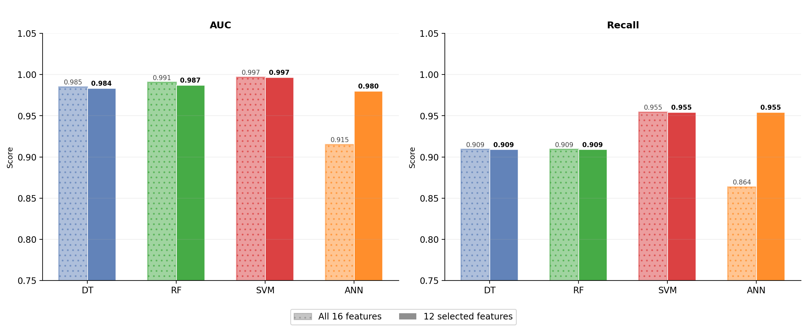
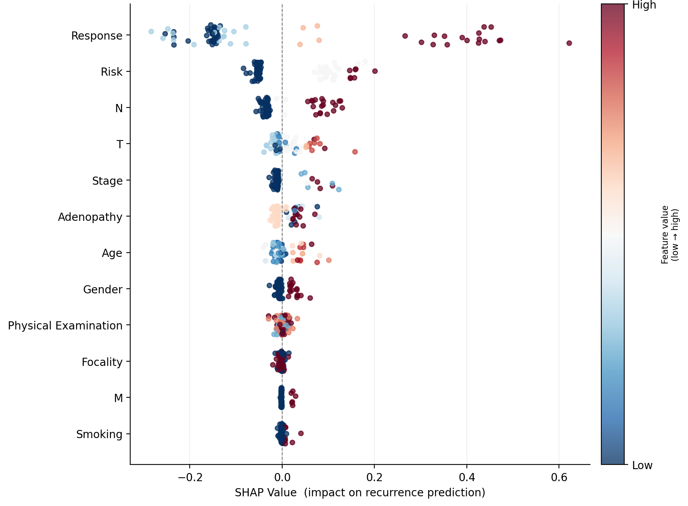
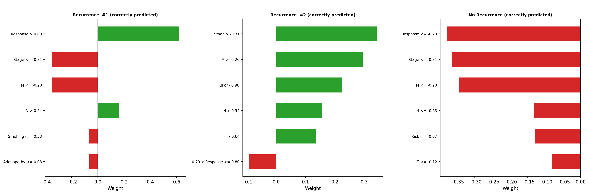
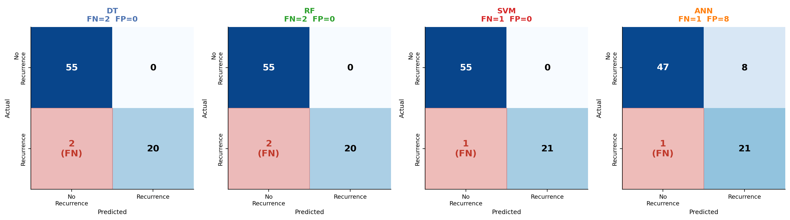

# Explainable Machine Learning for Differentiated Thyroid Cancer Recurrence Prediction

[](https://www.python.org/)
[](https://scikit-learn.org/)
[](LICENSE)
[]()

An explainable machine learning framework for predicting recurrence in Differentiated Thyroid Cancer (DTC), combining competitive predictive performance with systematic interpretability, hyperparameter analysis, and computational benchmarking.

> **Paper:** *Explainable Machine Learning Approach for Recurrence Prediction in Differentiated Thyroid Cancer* — under review for publication.

---

## Highlights

- **SVM achieved 98.7% accuracy and AUC of 0.9967** with only 1 false negative across 77 test instances
- **Random Forest** demonstrated superior cross-validation stability (AUC: 0.9857 ± 0.0133)
- **SHAP + LIME** applied for global and local interpretability — both identified Response, Risk, and N stage as dominant predictors
- **Leak-free pipeline**: feature selection and scaling fitted exclusively on the training partition
- Systematic analysis of split sensitivity, hyperparameter tuning, SMOTE effects, computational speed, and statistical significance

---

## Problem

Differentiated thyroid cancer has a favorable overall prognosis, but recurrence affects 5–30% of patients during follow-up. Accurate and interpretable prediction of recurrence risk is critical for timely clinical intervention and personalized patient management. Prior work primarily focused on maximizing accuracy while neglecting systematic evaluation of model robustness and explainability.

---

## Dataset

| Property | Value |
|----------|-------|
| Source | [UCI Machine Learning Repository](https://archive.ics.uci.edu/dataset/915/differentiated+thyroid+cancer+recurrence) |
| Patients | 383 |
| Features | 16 clinicopathological variables |
| Target | Recurrence status (binary) |
| Class distribution | 275 non-recurrence (71.8%) / 108 recurrence (28.2%) |
| Follow-up | 10–15 years per patient |

---

## Pipeline

```
Raw Dataset (383 × 17)
    │
    ├── Target encoding (Yes/No → 1/0)
    ├── Ordinal encoding (Risk, T, N, M, Stage, Response)
    └── Label encoding (binary & nominal features)
         │
         ▼
Stratified Split 80/20 (train: 306 / test: 77, seed=42)
         │
         ├── StandardScaler fitted on train only (for SVM & ANN)
         │
         ▼
Feature Selection (training set only)
    ├── Chi-Square statistical test
    └── RF Gini Importance
    → 16 features reduced to 12 (excluded: Thyroid Function, Pathology)
         │
         ▼
Model Training & Evaluation
    ├── Decision Tree (max_depth=5)
    ├── Random Forest (n_estimators=50)
    ├── SVM (C=50, RBF kernel)
    └── ANN (hidden layers: 64, 32)
         │
         ▼
Systematic Experiments
    ├── A. All features vs selected features
    ├── B. Train/test split sensitivity (90/10 → 70/30)
    ├── C. Computational speed benchmarking (50 runs)
    ├── D. Hyperparameter sensitivity analysis
    ├── E. Final hold-out + 5-fold stratified CV
    ├── F. SMOTE oversampling sensitivity
    └── G. Statistical significance (Wilcoxon + McNemar)
         │
         ▼
Explainability
    ├── SHAP (global, Random Forest)
    └── LIME (local, SVM — 3 representative instances)
```

---

## Results

### Hold-out Performance (80/20 split)

| Model | Accuracy | Precision | Recall | F1-score | AUC |
|-------|----------|-----------|--------|----------|-----|
| DT    | 0.974    | 1.000     | 0.9091 | 0.9524   | 0.9835 |
| RF    | 0.974    | 1.000     | 0.9091 | 0.9524   | 0.9872 |
| **SVM** | **0.987** | **1.000** | **0.9545** | **0.9767** | **0.9967** |
| ANN   | 0.8831   | 0.7241    | 0.9545 | 0.8235   | 0.9802 |

### 5-Fold Cross-Validation (AUC)

| Model | Mean | Std | Min | Max |
|-------|------|-----|-----|-----|
| DT    | 0.9534 | 0.0271 | 0.9139 | 0.9838 |
| **RF** | **0.9857** | **0.0133** | 0.9683 | 1.0000 |
| SVM   | 0.9708 | 0.0259 | 0.9238 | 0.9955 |
| ANN   | 0.9668 | 0.0195 | 0.9403 | 0.9920 |

### Explainability — Top Predictors

Both SHAP and LIME consistently identified the following as dominant predictors:

1. **Response** to initial treatment (SHAP mean |value|: 0.2090)
2. **Risk**: ATA risk stratification (0.0784)
3. **N**: Lymph node involvement (0.0493)
4. **T**: Tumor stage (0.0248)
5. **Stage**: Final staging (0.0203)

---

## Figures

<p align="center">
  
  <br><em>Feature Selection — Chi-Square and RF Gini Importance</em>
</p>

<p align="center">
  
  <br><em>SHAP Beeswarm — Random Forest (Test Set)</em>
</p>

<p align="center">
  
  <br><em>LIME Explanations — SVM Model (Instance-Level)</em>
</p>

<p align="center">
  
  <br><em>Confusion Matrices — Hold-out Test Set (80/20)</em>
</p>

---

## Repository Structure

```
├── README.md
├── notebokk/                       # Full reproducible experiment
├── data/                           # Dataset (UCI ML Repository)
├── figures/                        # All generated figures
├── saved_models/                   # Trained model files (.joblib)
└── LICENSE
```

---

## Quickstart

### Requirements

```bash
pip install numpy pandas matplotlib scikit-learn shap lime imbalanced-learn statsmodels joblib
```

### Run

1. Place `Thyroid_Diff.csv` in the same directory as the notebook
2. Open and run `dtc_recurrence_notebook.ipynb`
3. All figures are saved to the `figures/` directory
4. Trained models are exported to `saved_models/`

---

## Key Findings

- **SVM** is the best single-split performer; **RF** is the most robust under cross-validation
- Feature selection from 16 → 12 features preserved identical performance for DT, RF, SVM while improving ANN (+6.5% AUC)
- **SMOTE is unnecessary** for the best-performing model; moderate class imbalance is adequately handled by stratified splitting and hyperparameter tuning
- All models achieve sub-second inference, confirming suitability for clinical deployment
- Statistical significance tests (Wilcoxon, McNemar) confirm that SVM vs ANN is the only significant pairwise difference

---

## Citation

```bibtex
@article{mien2026dtc,
  title   = {Explainable Machine Learning Approach for Recurrence Prediction 
             in Differentiated Thyroid Cancer},
  author  = {Mien, Kounab{\'e} Paulin},
  year    = {2026},
  note    = {Under review}
}
```

---

## Author

**Kounabé Paulin MIEN**  
Master's Student in Computer Engineering — Erciyes University, Kayseri, Turkey  
Supervised by Assoc. Prof. Ahmet Nusret Toprak

📧 paulinmien1@gmail.com

---

## License

This project is licensed under the Apache License 2.0 — see [LICENSE](LICENSE) for details.
